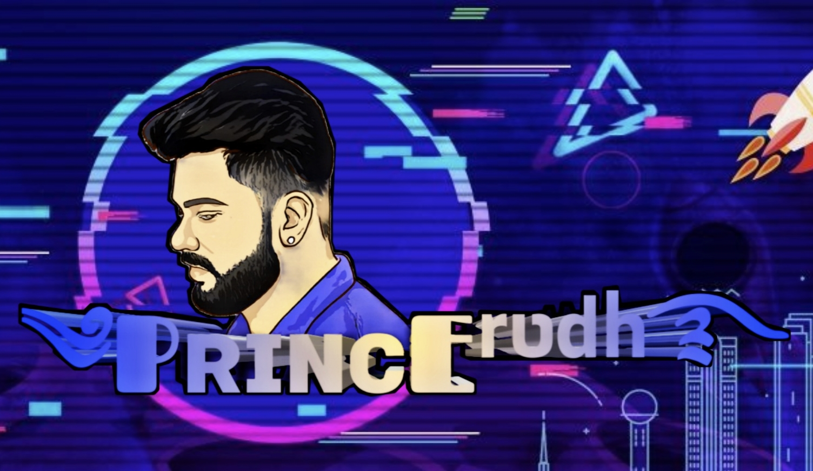

## 

 </a>

  

 

  

Project created by <a href="https://github.com/Princerudh">Princerudh</a> to make it public
     
       | © |
        Reserved |
      

----

<h3 align="center">Contact Me:</h3>

<h4 align="center">Support Video For Deploy Bot 👇:</h4>

  

&nbsp;

