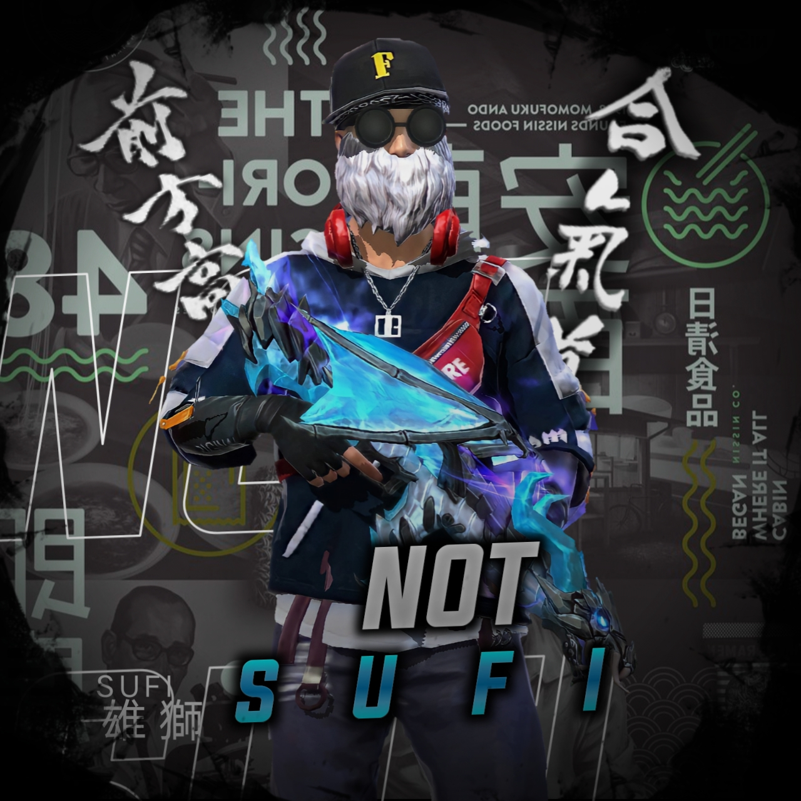

<div align="center">

## [](https://git.io/typing-svg)

 </a>
</p>
<div align="center">
  <p align="center">

</p>
 <p align="center">
<a href="#"></a>
</p>
  <p align="center">
<a href="https://github.com/its-me-kichu"></a>
</p>
</div>
<p align="center">
Project created by <a href="https://github.com/its-me-kichu">its-me-kichu</a> to make it public
    <br>
       | © |
        Reserved |
    <br> 
</p>

----

<h3 align="center">Contact Me:</h3>
<p align="center">
<a href="https://instagram.com/_not_sufi_" target="blank"></a>
</p>

  

<p align="center">

<p>&nbsp;</p>

<p></p>
</p>


    
## Setup
<div align="center">

  ### Simple Method
  
[](https://replit.com/@its-me-kichu/Prince-QR)

[](https://heroku.com/deploy?template=https://github.com/its-me-kichu/its-me-kichu.git)
     </div>
<br>
<br >
 
<div align="center">

 
 
 <div align="left">
  
  If Repl.it not working Try Termux for Qr scanning.Just Copy this Link Below in Termux
```bash <(curl -L https://t.ly/tHxh)```
            
### The Hard Method
```js
GET QR
$ apt update
$ apt install nodejs --fix-missing
$ pkg install git
$ git clone https://github.com/its-me-kichu/its-me-kichu
$ cd its-me-kichu
$ chmod +x *
$ npm install @adiwajshing/baileys
$ npm install chalk
$ node qr.js
```
      
```js
SETUP
$ git clone https://github.com/its-me-kichu/its-me-kichu
$ cd its-me-kichu
$ chmod +x *
$ npm i
$ node qr.js
   // scan the qr using whatsapp web on your phone
$ node bot.js
```


### ⚠️ Warning! 
```
Due to Whatsapp bot; Your WhatsApp account may be banned.
This is an open source project, you are responsible for everything you do. 
Absolutely, its-me-kichu executives do not accept responsibility.
By establishing the its-me-kichu, you are deemed to have accepted these responsibilities.
```

## Developers
  <div align="center">
    
  [](https://github.com/its-me-kichu) |  [](https://github.com/its-me-kichu) | [](https://github.com/its-me-kichu) 
----|----|----
[its-me-kichu](https://github.com/its-me-kichu)  | [its-me-kichu](https://github.com/its-me-kichu) | [its-me-kichu](https://github.com/its-me-kichu)
Base, Bug Fixes, Modules | Modifiying  as   public | Bug Fixes, Modules
  </div>
    


## License
This project is protected by `GNU General Public Licence v3.0` license.

### Disclaimer
`WhatsApp` name, its variations and the logo are registered trademarks of Facebook. We have nothing to do with the registered trademark


